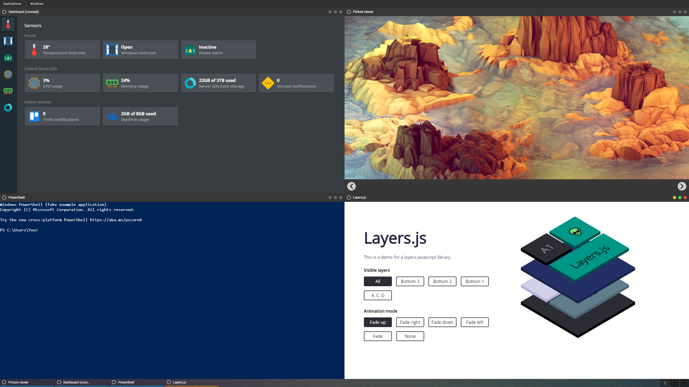
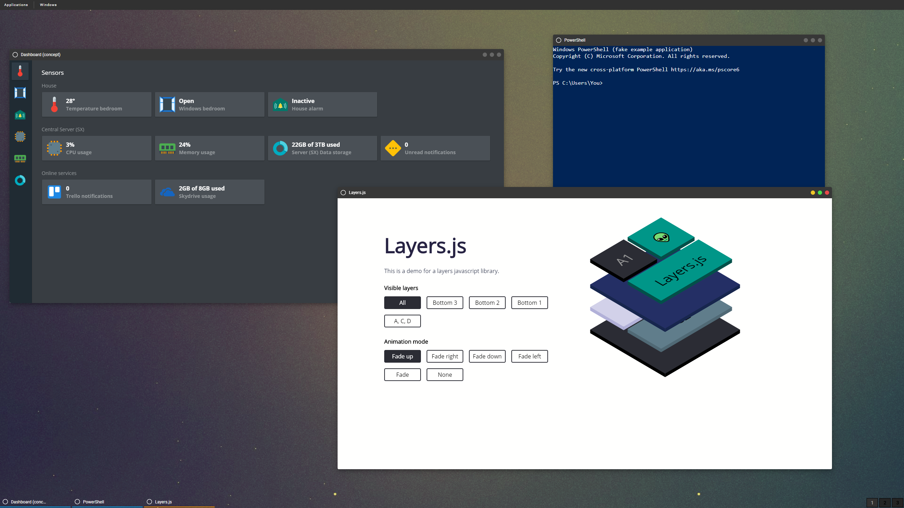
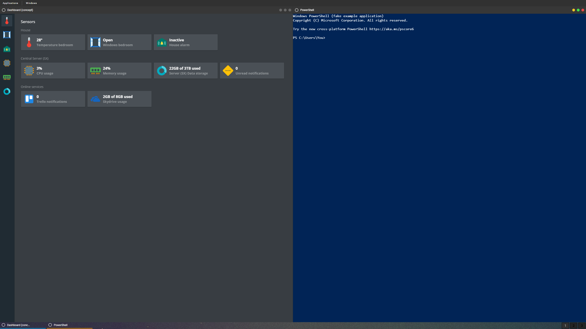

The Elara Window Manager

---

## Demo

[LIVE DEMO](https://hlhielkema.github.io/elara/)

## Screenshots










[View more](screenshots/)

---

## Build

https://nodejs.org/en/

```
npm run build
```

## Features
-	Move windows around the screen.
-	Resize windows from all sides.
-	Maximize/Minimize/Close windows.
-	Dock windows on the sides or in the corners of the screen.
-	Double click the top of the window to maximize it.
-	Select windows with the taskbar on the bottom of the screen.
-	Switch between unlimited workspaces, each with their own set of active windows.
-	Grab windows to bring them to the top level.
-	Animations and smooth movement.
-	Split windows, cascade windows, maximize/minimize/show all.
