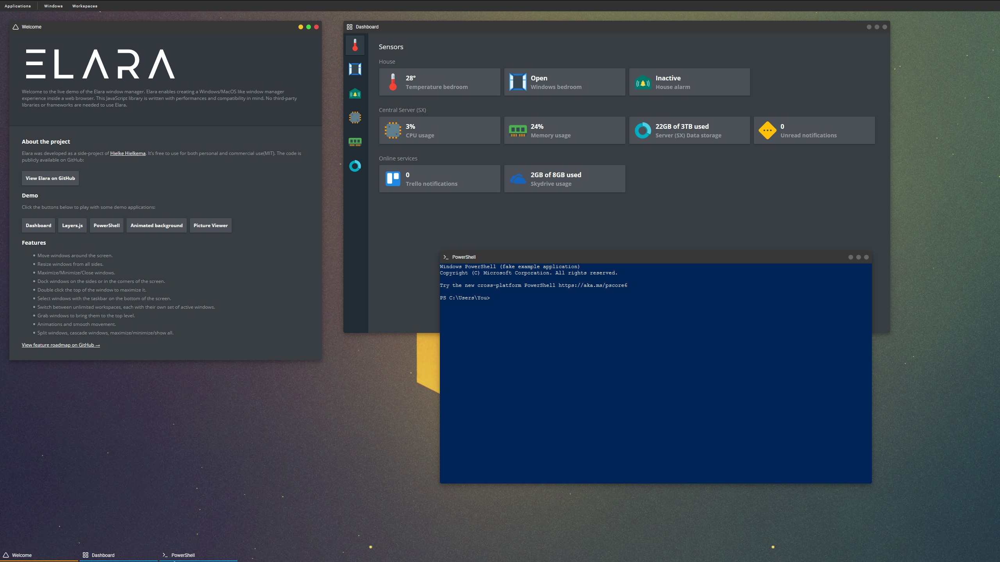
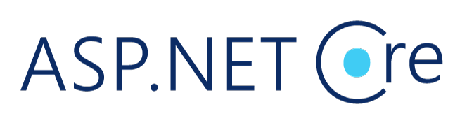

Elara enables creating a Windows/MacOS like window manager experience inside a web browser. This JavaScript library is written with performances and compatibility in mind. No third-party libraries or frameworks are needed to use Elara.

[](https://hlhielkema.github.io/elara/)

---

## Live demo

Open the [LIVE DEMO](https://hlhielkema.github.io/elara/) to try Elara yourself.

*Scroll down for some screenshots.*

> The demo site is hosted using GitHub pages. Running Elara requires no back-end code besides static file hosting.



---

## Features
-	Move windows around the screen.
-	Resize windows from all sides.
-	Maximize/Minimize/Close windows.
-	Dock windows on the sides or in the corners of the screen.
-	Double click the top of the window to maximize it.
-	Select windows with the taskbar on the bottom of the screen.
-	Switch between unlimited workspaces, each with their own set of active windows.
-	Grab windows to bring them to the top level.
-	Animations and smooth movement.
-	Split windows, cascade windows, maximize/minimize/show all.


## Build
Bundling the Elara code into a single Javascript and CSS file with **Webpack** requires **Node.js**. [Install Node.js](https://nodejs.org/en/) and run the command below to bundle Elara. The files that can be used for distribution will be placed in the `/dist` directory.

```
npm run build
```

Grab the files from the `/dist` directory if you want only to use Elara without modifying it.


## Run local demo server
The Elara library itself does not require any backend to work. However, just opening *index.html* on your local system will not work properly. This repository contains 3 implementations of simple servers to try or test Elara. Each server is written in a different programming language. Please use the server implementation you prefer. Use the online live demo described earlier in this document if you just want to try the last stable version of Elara. The server implementations are written in:

- Node.js
- ASP.NET Core
- Go

---

### Node.js demo server


*Command:*
``` ps
node demo\nodejs\server.js
```

*Output:*
```
Routes:
"/"       ->: D:\GitHub Workspace\elara\demo\shared\index.html
"/dist/*" ->: D:\GitHub Workspace\elara\dist
"/*"      ->: D:\GitHub Workspace\elara\demo\shared

Elara demo server running at http://127.0.0.1:3000/
```

> TIP: Press Ctrl+C to shut down.

---

### ASP.NET Core demo server



*Command:*
``` ps
cd "demo\aspnetcore\ElaraDemo"
dotnet run
```

*Output:*
```
info: Microsoft.Hosting.Lifetime[0]
      Now listening on: https://localhost:5001
info: Microsoft.Hosting.Lifetime[0]
      Now listening on: http://localhost:5000 
info: Microsoft.Hosting.Lifetime[0]
      Application started. Press Ctrl+C to shut down.
info: Microsoft.Hosting.Lifetime[0]
      Hosting environment: Development
info: Microsoft.Hosting.Lifetime[0]
      Content root path: D:\GitHub Workspace\elara\demo\aspnetcore\ElaraDemo
```

> TIP: Press Ctrl+C to shut down.

---

### Go demo server


## Build and run

*Command:*
```
cd demo/go
go build server.go
.\server.exe
```

*Output:*
```
2020/03/07 13:50:14 Listening on :3500..
```

> TIP: Press Ctrl+C to shut down.

---

## Screenshots


[View more](screenshots/)

---

## Third-party resources

### Feather
Some of the icons used in the demo are from the Feather icon pack. Feather is licensed under the MIT License.

- Website: [feathericons.com](https://feathericons.com)
- GitHub: [feathericons/feather](https://github.com/feathericons/feather)